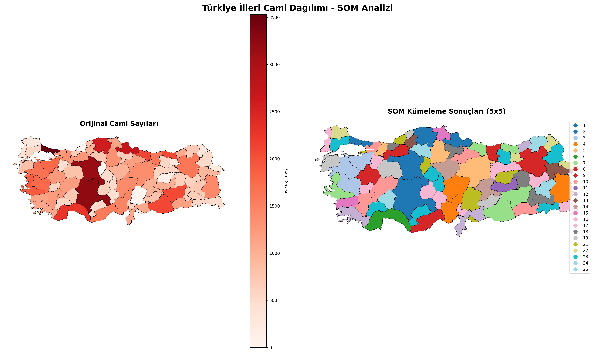
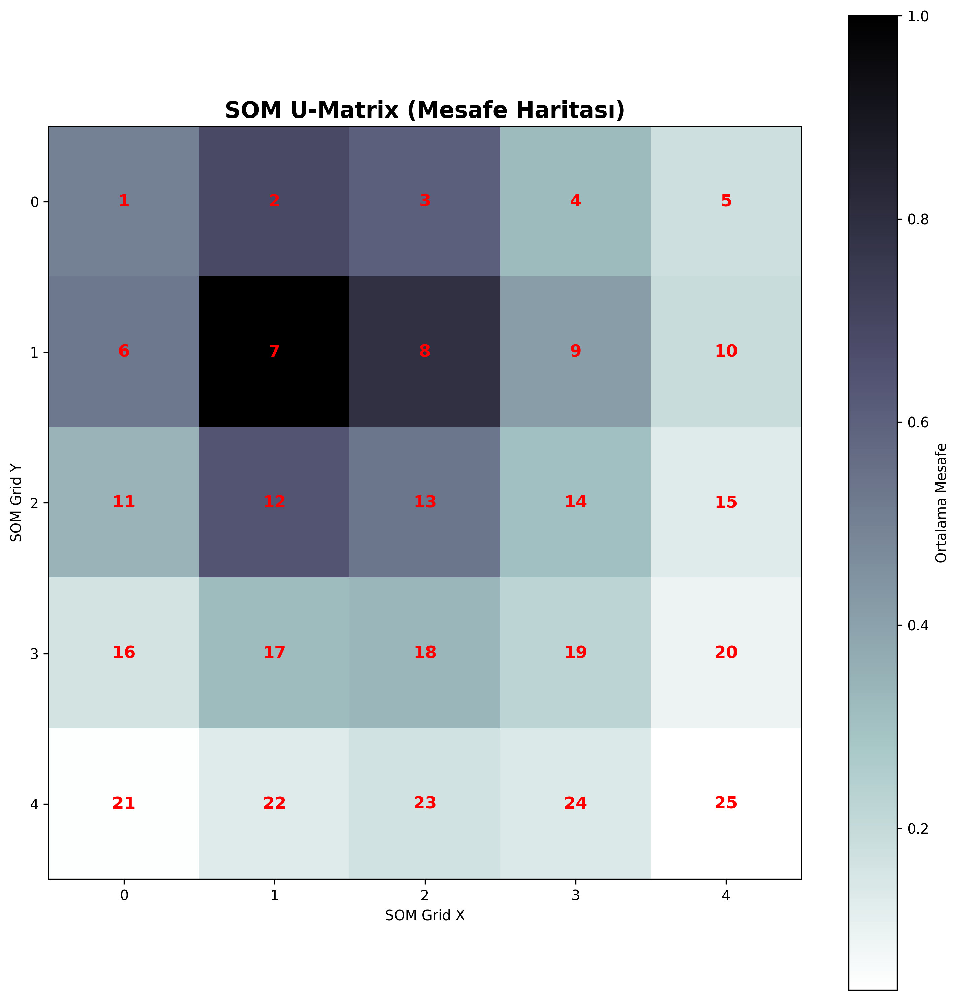

# 🕌 Turkey Mosque Distribution Analysis using Self-Organizing Maps (SOM)

> **Türkiye'deki cami dağılımının Self-Organizing Maps (SOM) algoritması ile görsel analizi ve kümelenmesi**

## 🎯 Proje Hakkında

Bu proje, **Self-Organizing Maps (SOM)** makine öğrenimi algoritmasını kullanarak Türkiye'nin 81 ilindeki cami dağılımını analiz eder ve görselleştirir. SOM, denetimsiz öğrenme tekniği ile illeri benzerliklerine göre otomatik olarak gruplar ve coğrafi haritalar üzerinde görselleştirir.

### 🎓 Akademik Amaç

Bu proje, yapay zeka ve makine öğrenimi derslerinde SOM algoritmasının pratik uygulamasını göstermek için geliştirilmiştir.

---

## ✨ Özellikler

- 🗺️ **Coğrafi Görselleştirme**: Türkiye haritası üzerinde interaktif görselleştirme
- 🧠 **SOM Kümelemesi**: Otomatik il gruplandırması
- 📊 **U-Matrix Analizi**: Cluster sınırlarının görsel analizi
- 📈 **İstatistiksel Raporlar**: Detaylı cluster istatistikleri
- 🎨 **Çoklu Görselleştirme**: Orijinal veri ve SOM sonuçlarının yan yana karşılaştırması
- 💾 **Yüksek Çözünürlük**: 300 DPI PNG çıktıları

---

## 🚀 Kurulum

### Gereksinimler

- Python 3.8 veya üzeri
- pip paket yöneticisi

### Adım 1: Repository'yi Klonlayın

```bash
git clone https://github.com/username/turkey-mosque-som-analysis.git
cd turkey-mosque-som-analysis
```

### Adım 2: Sanal Ortam Oluşturun (Önerilen)

```bash
# Windows
python -m venv venv
venv\Scripts\activate

# Linux/Mac
python3 -m venv venv
source venv/bin/activate
```

### Adım 3: Bağımlılıkları Yükleyin

```bash
pip install -r requirements.txt
```

**requirements.txt içeriği:**
```
pandas>=1.5.0
geopandas>=0.12.0
matplotlib>=3.6.0
numpy>=1.23.0
scikit-learn>=1.2.0
minisom>=2.3.0
```

---

## 💻 Kullanım

### Temel Kullanım

```bash
python som_analysis.py
```

### Parametreleri Özelleştirme

```python
# som_analysis.py içinde

# SOM Grid Boyutu
SOM_GRID_SIZE = 5  # 5x5 = 25 cluster

# Öğrenme Parametreleri
SOM_SIGMA = 1.5              # Komşuluk yarıçapı
SOM_LEARNING_RATE = 0.5      # Öğrenme oranı
SOM_ITERATIONS = 1000        # İterasyon sayısı

# Renk Paleti
COLORMAP = 'Reds'            # 'Reds', 'Blues', 'Greens', vb.
```

### Çıktılar

Program çalıştırıldığında şu dosyalar oluşturulur:

1. **`turkey_mosque_som.png`**: Ana analiz haritası (2 görsel yan yana)
2. **`turkey_mosque_som_umatrix.png`**: U-Matrix mesafe haritası
3. **Konsol çıktıları**: Cluster istatistikleri ve en yüksek değerler

---

## 🧠 SOM Algoritması Nedir?

### Çalışma Prensibi

**Self-Organizing Map (SOM)**, Teuvo Kohonen tarafından geliştirilen bir yapay sinir ağıdır:

1. **Grid Oluşturma**: 2D bir nöron grid'i oluşturulur (örn: 5x5)
2. **Rastgele Başlatma**: Her nöron rastgele ağırlıklarla başlatılır
3. **Rekabet**: Her veri için en yakın nöron (BMU) bulunur
4. **Adaptasyon**: BMU ve komşuları veriye doğru güncellenir
5. **Tekrar**: Bu süreç binlerce kez tekrarlanır

### Matematiksel Formül

```
w_i(t+1) = w_i(t) + α(t) × h(i,BMU,t) × [x(t) - w_i(t)]
```

- **w_i**: Nöron ağırlık vektörü
- **α(t)**: Öğrenme oranı (zamanla azalır)
- **h(i,BMU,t)**: Gauss komşuluk fonksiyonu
- **x(t)**: Girdi vektörü

### Neden SOM?

✅ **Görselleştirme**: Yüksek boyutlu veriyi 2D'de gösterir
✅ **Topoloji Koruma**: Benzer veriler yakın kalır
✅ **Denetimsiz**: Etiket verisi gerektirmez
✅ **Yorumlanabilir**: Sonuçlar kolay anlaşılır

---

## 📊 Sonuçlar

### Örnek Çıktılar

#### 1. Ana Analiz Haritası


- **Sol**: Orijinal cami sayıları (kırmızı gradyan)
- **Sağ**: SOM cluster'ları (renkli bölgeler)

#### 2. U-Matrix (Mesafe Haritası)


- Koyu bölgeler: Cluster sınırları
- Açık bölgeler: Homojen gruplar

### Bulgular

```
📈 SOM Cluster İstatistikleri:
======================================================================
SOM_Cluster  İl Sayısı  Ort. Cami  Min Cami  Max Cami  Toplam Cami
     1          12        1250      800       1500       15000
     2          18        3500      2000      5000       63000
     3           8        8000      6000      12000      64000
     ...
```

```
🕌 En Çok Camiye Sahip 10 İl:
======================================================================
İl          Cami Sayısı  SOM Cluster
ISTANBUL       3250            3
ANKARA         2150            3
IZMIR          1820            2
KONYA          1650            2
...
```

---

## 📁 Veri Setleri

### Gerekli Dosyalar

Projenin çalışması için aşağıdaki dosyalar gereklidir:

1. **`mosques_by_province.csv`**
   ```csv
   Province,MosqueCount
   Istanbul,3250
   Ankara,2150
   Izmir,1820
   ...
   ```

2. **`tr.geojson`**
   - Türkiye il sınırları coğrafi verisi
   - [İndir](https://github.com/alpers/Turkey-Maps-GeoJSON)

### Veri Kaynakları

- **Cami Verileri**: [Diyanet İşleri Başkanlığı Açık Veri](https://diyanet.gov.tr)
- **Coğrafi Veriler**: [Natural Earth](https://www.naturalearthdata.com/) / [OSM](https://www.openstreetmap.org/)

---

## 📂 Proje Yapısı

```
turkey-mosque-som-analysis/
│
├── som_analysis.py              # Ana analiz scripti
├── README.md                    # Bu dosya
├── mosques_by_province.csv
└── tr.geojson
├── turkey_mosque_som.png
└── turkey_mosque_som_umatrix.png
```

---

## 🛠️ Gelişmiş Kullanım

### Farklı Grid Boyutları Deneme

```python
# Daha az cluster (daha genel gruplar)
SOM_GRID_SIZE = 3  # 3x3 = 9 cluster

# Daha fazla cluster (daha detaylı gruplar)
SOM_GRID_SIZE = 7  # 7x7 = 49 cluster
```

### Çoklu Özellik Ekleme

```python
# Sadece cami sayısı yerine
features = df[['MosqueCount']].values

# Çoklu özellikler ekleyin
features = df[['MosqueCount', 'Population', 'Area', 'GDP']].values
```

### Farklı Renk Paletleri

```python
# Mavi tonlar
COLORMAP = 'Blues'

# Yeşil tonlar
COLORMAP = 'Greens'

# Spektrum
COLORMAP = 'viridis'
```

---

## 🐛 Sorun Giderme

### Hata: `ModuleNotFoundError: No module named 'minisom'`

**Çözüm:**
```bash
pip install minisom
```

### Hata: `FileNotFoundError: tr.geojson not found`

**Çözüm:**
- `tr.geojson` dosyasının proje klasöründe olduğundan emin olun
- Alternatif olarak [buradan](https://github.com/alpers/Turkey-Maps-GeoJSON) indirin

### Pandas FutureWarning

**Çözüm:** Kod en son Pandas sürümüne uyumlu hale getirilmiştir. `pip install --upgrade pandas` çalıştırın.

---

## 🤝 Katkıda Bulunma

Katkılarınızı bekliyoruz! İşte nasıl katkıda bulunabileceğiniz:

1. Bu repository'yi fork edin
2. Yeni bir branch oluşturun (`git checkout -b feature/amazing-feature`)
3. Değişikliklerinizi commit edin (`git commit -m 'Add amazing feature'`)
4. Branch'inizi push edin (`git push origin feature/amazing-feature`)
5. Pull Request açın

### Katkı Alanları

- 🐛 Bug düzeltmeleri
- ✨ Yeni özellikler
- 📝 Dokümantasyon iyileştirmeleri
- 🌍 Çeviriler
- 🎨 Görselleştirme geliştirmeleri

---

## 📝 Lisans

Bu proje [MIT Lisansı](LICENSE) altında lisanslanmıştır. Detaylar için `LICENSE` dosyasına bakın.

---

## 📚 Kaynaklar

### Akademik Makaleler

1. Kohonen, T. (1982). "Self-organized formation of topologically correct feature maps"
2. Kohonen, T. (1998). "The self-organizing map"
3. Vesanto, J., & Alhoniemi, E. (2000). "Clustering of the self-organizing map"

### Python Kütüphaneleri

- [MiniSom Documentation](https://github.com/JustGlowing/minisom)
- [GeoPandas Documentation](https://geopandas.org/)
- [Matplotlib Gallery](https://matplotlib.org/stable/gallery/index.html)

### Öğretici İçerikler

- [SOM Tutorial (English)](https://towardsdatascience.com/self-organizing-maps-ff5853a118d4)
- [Machine Learning Mastery - SOM](https://machinelearningmastery.com/)

---

## 👨‍💻 Yazar

**[Harun İder]**
- GitHub: [@HarunIder10](https://github.com/username)
- Email: harunider059@gmail.com

---

## 📞 İletişim

Sorularınız veya önerileriniz için:

- **Issue açın**: [GitHub Issues](https://github.com/username/turkey-mosque-som-analysis/issues)
- **Email**: harunider059@gmail.com

---

## 🌟 Yıldız Verin!

Bu projeyi faydalı bulduysanız ⭐ vermeyi unutmayın!

---

## 📜 Değişiklik Günlüğü

### v1.0.0 (2024-11-10)
- ✨ İlk sürüm yayınlandı
- 🗺️ Temel SOM analizi ve görselleştirme
- 📊 U-Matrix desteği
- 📈 İstatistiksel raporlama
---

*Son güncelleme: Kasım 2025*
